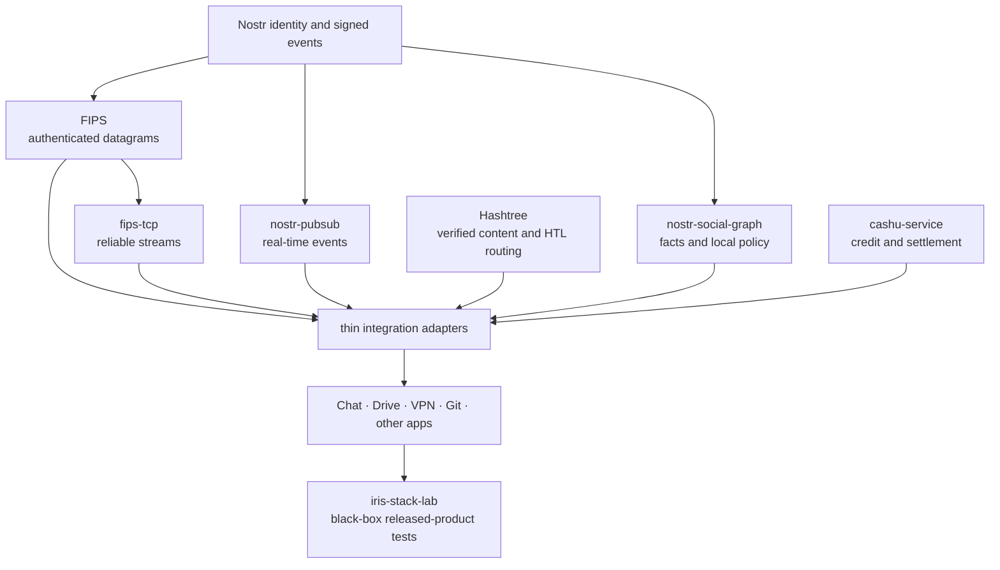

# Iris Stack status and test ownership

This is an engineering assessment as of 2026-07-16. It complements the
[architecture overview](iris-stack.md): the overview explains the intended
system, while this page distinguishes implemented foundations from integration
work and assigns tests to the repository that owns each failure.

## Overall assessment

The stack has the essential building blocks for permissionless identity,
authenticated connectivity, reliable streams, decentralized real-time events,
verified storage and content routing, viewer-local social policy, and
permissionless settlement. Decentralized compute is not required to make those
capabilities useful. If it becomes useful, it can be introduced later as a
metered service route rather than inserted into every layer.

The principal risk is now integration complexity, not a missing universal
protocol. The architecture stays tractable when it enforces four rules:

1. One repository owns each wire contract and its resource bounds.
2. Capability cores do not depend on product repositories or the stack lab.
3. Products remain standalone and retain their application-owned outbound
   links when same-host peers appear or disappear.
4. A shared abstraction should delete more policy and failure modes than it
   adds; similar-looking code is not enough reason to merge semantics.

The economic loop is less mature than the protocol loop. The stack lab
composes Cashu service credit, receipts, a real local CDK mint, an offline
failure, payer replacement, exact-token replay, double-spend rejection, and
settlement recovery across operating-system processes. Paid forwarding and
paid storage still need product-specific gates that bind an authenticated
service effect to the receipt and receiver acknowledgement before they should
be described as a deployed market.

## Dependency direction

Optional adapters may join capabilities; they must not invert the arrows. In
particular, `nostr-pubsub` announces events and content references but is not a
blob-routing layer. FIPS transports authenticated traffic but does not own
Hashtree HTL or settlement policy.

## Component status

| Area | Evidence as of 2026-07-16 | Remaining integration risk |
| --- | --- | --- |
| FIPS | Rust 0.4.6 and TypeScript runtime 0.0.26 provide authenticated links, fixed loopback UDP rendezvous, capability exchange, routing, and multiple carriers. The same-host identity hint is proved by the ordinary authenticated handshake. The cross-language Chromium matrix passed 16/16 plus five sequential replacement-page repetitions against native 0.4.5. | Continue cross-carrier churn, bounded-admission, and mobile lifecycle gates. A local peer must never become a mandatory daemon or implicit egress owner. |
| `fips-tcp` | Rust crates 0.2.0 provide reliable ordered streams over FIPS and cross-language wire fixtures. | Reset, retransmission, acknowledgment, backpressure, and long loss/reordering simulations belong here. Application record delivery is a separate semantic layer. |
| `nostr-pubsub` | Core 0.1.11 and FIPS adapter 0.3.1 share the standard `REQ`/`EVENT`/`CLOSE` service and have simulator, stress, role-blind discovery, and Cashu-incentive gates. | Browser and native consumers must use the shared carrier instead of product-private endpoint namespaces. Offline history remains a storage concern. |
| Hashtree | Core 0.2.86, LMDB 0.2.85, network 0.2.85, FIPS transport 0.4.6, and CLI 0.2.97 provide one adaptive read-only `BlobRouter` over opaque routes and one application-owned adaptive `PoolStore` with bounded temperature balancing. Multiprocess crash/resize/pin/GC, bounded multi-terabyte metadata behavior, HTL, corruption, provider churn, and native product gates pass. | Keep exercising multi-hop churn and bounded recovery through released artifacts. |
| Social graph and facts | Signed facts, graph traversal, social policy, UUID identity tools, exact fact lookup, and the `nostr-identity` 0.4.0 crate exist. | Unify fact-name search and recovery UX; gate FIPS identity bindings and resource-policy inputs without creating a global reputation score. |
| Cashu service layer | Published `cashu-service` 0.3.1 owns bounded peer credit, useful-service receipts, Cashu transfer, and settlement adapters. The stack process gate uses its real loopback CDK mints and SQLite wallets to prove offline failure, payer death/replacement, exact-token recovery, second-receiver rejection, receiver-ACK completion, and conservation. | Bind the generic recovery path to authenticated paid bandwidth and storage effects. Mint trust and cross-mint settlement remain explicit policy. |
| Iris Chat | Native 0.1.39 uses the canonical FIPS Nostr relay adapter for roster-authorized device links, shared decentralized pub/sub, paged device synchronization, and optional same-host Hashtree reads. The released Stack fixture calls its production attachment reader. | Keep native and browser device-sync fixtures byte-compatible, and test connection loss after local stream acceptance so resynchronization—not wishful delivery—is the recovery mechanism. |
| Nostr VPN | Source tag 4.0.95 at `4c43cc5761d67e5dc1a9a4de30c829ae45dc37f3` has a canonical two-process Docker gate: explicit application-owned UDP roster links carry bidirectional traffic while a signed kind-37196 event crosses shared TCP/FIPS pubsub. Iris Stack pins and delegates to that owner test. | The VPN gate and Chat/Drive/Hashtree gate are separate process scenarios; test their simultaneous churn later. Do not delegate VPN routes or roster policy to a same-host process. |
| Iris Drive | Hashtree full-history commit `f4f7b286714fc07988f9fffae182d7776ae6f842` and byte-identical GitHub snapshot `944dc0127c67efafe353d90cf855d56d42783469` pin the adaptive Hashtree/FIPS tuple. The product and Stack gates prove exact roster ACLs, relay-only WebRTC bootstrap, provider death and replacement, standalone retrieval, and preservation of Drive-owned outbound links. | Keep the released-product gate in the cross-platform matrix and extend it to larger multi-frame trees under sustained churn. |
| Iris Git | Web release 0.1.4 uses Hashtree roots plus an exact-provider FIPS bridge and a real registry CLI/browser process gate. | Treat paid repository storage as a product integration, not a reason to fork Hashtree transport or Git object semantics. |

Versions identify the verified native release boundary on the stated date; the
repository sources and package registries remain the authority for later
versions.

### Reproducible native release evidence

- FIPS Rust `v0.4.6` is commit
  `7c5100a2e076e58dfeafa3c80341e295e65e8d39`. The published `fips-core`
  0.4.6 crate checksum is
  `12cc0df5e04a1aae16efa85313976e87eb037d6e7955b8a035febd91b00383dc`;
  the published `fips-endpoint` 0.4.6 checksum is
  `510adeaf1aa5ecacf71064750502a3e7d8f4b58c22e98ea8b3adbff260cf96e0`.
- FIPS TypeScript `runtime-v0.0.26` is commit
  `7295a1243ec1d9ea48cf713eb7594e6f365850dc`: core 0.0.26, browser
  0.0.8, WebRTC 0.0.42, Ethernet 0.0.25, and memory 0.0.6. Its full
  native-0.4.5 Chromium matrix passed 16/16 and the sequential replacement
  path passed another 5/5 repetitions.
- Hashtree `v0.2.97` is commit
  `b96ae9e29176478e847f5d9c57697d0a7074909e`. Published checksums are
  `574476b1fe122bddc7783ba0346dca42ec673a241128b0edf9e38166c1bb800f`
  for core 0.2.86,
  `e61f72986fce9c84f9fd03c72c581af092e25ea698e8b7bc54ddc18fe821286b`
  for LMDB 0.2.85,
  `1c7668c591e04c3326165eb2e85cf878baf8348601e36c6086ecec6f451354f5`
  for network 0.2.85,
  `3817b451831f915787090cb1ca33dac2e5313bc1e5afd2da515f0e57bb0c997f`
  for FIPS transport 0.4.6, and
  `68f50690aa798fa948a47ed2870b7d6f65f30ae40b6096dcde2422b1adcd02e5`
  for CLI 0.2.97.
- Iris Chat source commit
  `6514f424fc16b0d435a22a98081fc4569c15ad2a` released `iris-chat`
  0.1.39 with checksum
  `abace4c0bcb00ff946e8501066a4abd083d08963e8e17bcc7c7bd4647f95cb54`.
  Its registry package, all-target/all-feature tests, strict Clippy, and real
  roster-authorized relay process test passed.
- `nostr-identity` 0.4.0 was released from the social-graph repository at
  commit `d8faabd1bf865f4cf95c9d56eddf99de31436862`; its published crate
  checksum is
  `95fd048871579a175d1c38d1ea947f1034206d93696ea7ac74d140979e8022bb`.
- `cashu-service` source commit
  `b45a7e16744928b2ebae54e42e8f62c1d7eabdcb` is available from both its
  Hashtree and GitHub remotes. The published `cashu-service` 0.3.1 checksum is
  `c339af6a3c7a748230e980df1e89c4199532b33222d3c47e0cf148ab4d15498f`;
  the published `cashu-credit` 0.3.0 checksum is
  `c35743015747540d9c912284f10ccf89c40ded00c51fd3710c08c60700c71339`.
  The `cashu_payment_product` process gate consumes those registry artifacts;
  it proves the generic service-payment failure/replay/resumption boundary, not
  a paid Iris product meter.
- Nostr VPN source tag 4.0.95 at
  `4c43cc5761d67e5dc1a9a4de30c829ae45dc37f3` owns
  `scripts/e2e-connect-docker.sh`. Its two real processes preserve explicit
  UDP roster traffic in both directions while delivering a signed kind-37196
  paid-exit event through the shared TCP/FIPS pubsub service. Iris Stack's
  `scripts/vpn-product-lab.sh` fetches that exact snapshot and invokes the
  owner harness without copying its protocol or topology.

## Repository organization

Keep the capability repositories separate. Their state machines, release
cadence, fuzz targets, language implementations, and downstream consumers are
different enough that a monorepo would hide rather than remove coupling.

| Repository | Owns | Must not own |
| --- | --- | --- |
| `nostr-protocol/nips` | Portable public-key identity and the signed-event format | Application authorization, event distribution, social interpretation, or transport |
| `fips` / `fips-ts` | Public-key-addressed links, Noise authentication, carriers, routing, discovery, admission, authenticated capability roster | Reliable application streams, blob HTL, event subscription policy, product egress policy |
| `fips-tcp` | Reliable ordered byte streams and their Rust/TypeScript wire contract | Product record schemas or application commit semantics |
| `nostr-pubsub` | Nostr subscription/event protocol, source policy, deduplication, carrier adapters | Blob transfer, durable mailbox/history, product-specific event formats |
| `nostr-double-ratchet` | End-to-end encrypted 1:1 sessions, group sender keys, and multi-device session management | General event distribution, product conversation state, or UI |
| `hashtree` | Blob/tree formats, verification, cache policy, `BlobRoute`, HTL forwarding, Git/release data, and paid route wrappers | FIPS link routing, Nostr event distribution, product UI |
| `@hashtree/index` / `@hashtree/collection` | Immutable B-tree indexes, canonical records, derived search roots, and collection manifests | Source completeness, global query policy, or mutable database authority |
| `nostr-social-graph` | Signed fact interpretation, graph traversal, contextual names, reputation and policy inputs | A global name registry or global trust score |
| `cashu-service` | Credit, receipts, transfer and settlement primitives | Product pricing, access policy, or claims of globally trusted mints |
| Product repositories | Startup, authorization, durable product effects, user policy, explicit peers and outbound links | Copies of capability carriers, discovery protocols, or retry state machines |
| `iris-kit` | Shared web integration and UI packages | Capability wire contracts or product-owned policy |
| `iris-stack` | Durable public architecture, machine-readable ownership map, and black-box process/released-artifact lab | Another implementation of FIPS, TCP/FIPS, pub/sub, Hashtree, or product logic |

`iris-stack-lab` therefore belongs in this repository. It is a consumer-only
integration lab and must never become a dependency of a capability or product.

## Test ownership

Tests should be placed where the failed invariant can be fixed without editing
an unrelated layer.

| Repository | Required gates |
| --- | --- |
| `fips` | Noise identity proof; capability authenticity; route and carrier churn; fixed-loopback bind/rebind; admission/resource bounds; every app retaining independent direct links |
| `fips-tcp` | Loss, duplication, reordering, reset, marker acknowledgment, flow control, concurrent streams, bounded buffers, and Rust/TypeScript vectors/process interop |
| `nostr-pubsub` | Codec vectors; inventory/want convergence; deduplication; role-blind discovery; malicious peers; simulator scale; real FIPS and Cashu adapters |
| `nostr-double-ratchet` | TypeScript/Rust interop; 1:1 ratchet recovery; group sender-key rotation; multi-device authorization; replay and malformed-event handling |
| `hashtree` | Local hit/miss; exact HTL decrement; multi-hop and cycles; bounded fan-out; route-local `NoResult`; timeout/error distinction; corrupt reply rejection; cache population; provider replacement; paid route behavior |
| `nostr-social-graph` | Deterministic graph and fact interpretation; key/device binding; local-policy boundaries; malicious or conflicting claims |
| `cashu-service` | Credit limits; idempotent receipts; double-spend/replay rejection; partial settlement; mint outage; restart recovery; real local-mint processes |
| Product repositories | Standalone startup; explicit outbound links; authorization; durable effects; app protocol recovery; graceful and forced dependency death |
| `iris-stack` | Released-artifact compatibility; several real product processes on one host; same-host discovery; provider churn; direct egress preservation; paid route and crash matrices |

Simulators should run production state machines, not simplified copies.
Deterministic protocol simulations stay with their owner; cross-repository
black-box simulations stay here. Release gates should prefer registry artifacts
and consumer lockfiles. Path dependencies are useful during development but
cannot prove that published packages compose.

## Redundancy and complexity audit

The desired direction is one implementation per semantic responsibility:

- One fixed-loopback FIPS UDP rendezvous mechanism. No parallel filesystem,
  TCP, Ethernet-only, daemon-election, or shared-egress protocol.
- One authenticated FSP capability roster. The plaintext loopback exchange is
  only an identity hint and carries no capabilities or policy.
- One Hashtree blob request/reply contract for local stores, same-host
  providers, remote mesh routes, cloud adapters, and paid wrappers. `NoResult`
  means only that one bounded route produced no data.
- One Hashtree HTL router. FIPS hops and terminal adapters do not consume HTL.
- One standard Nostr pub/sub service. Large bytes travel through Hashtree, not
  through a second pub/sub blob protocol.
- Product-owned control and synchronization schemas remain product-owned until
  an extraction removes meaningful code and preserves their different retry,
  authorization, resync, and commit semantics.

The native Hashtree migration removed thousands of lines of duplicate carrier
code. Similar cleanup in products is valuable when it deletes a private
transport, but a tiny common frame codec alone is not automatically a
simplification: if the shared package plus language parity adds more code than
the consumers remove, wait for stronger semantic convergence or a third user.
The remaining CLI `DataRequest` path and `webrtc_stub` consolidation are
explicitly deferred to the Hashtree repository until equivalent owner-level
coverage permits deletion; Iris Stack must not grow replacement shims for
either.

## Priority test backlog

1. Add Nostr VPN to the released Chat/Drive/Hashtree composition. Kill and
   replace local providers while every product retains its own explicit
   outbound connectivity.
2. Bind paid FIPS forwarding and paid Hashtree storage to the verified generic
   Cashu recovery gate. Inject product-effect rejection, timeout, duplicate
   receipt, crash, restart, and eventual receiver acknowledgement.
3. Enforce the same native/TypeScript fixtures in owner-repository release
   gates, including browser constraints where native loopback UDP is not
   available.
4. Add long-running loss, churn, bounded-memory, file-descriptor, and process
   death tests using production state machines.
5. Gate exact authenticated capability and service-port selection so an
   arbitrary connected peer can never be mistaken for a provider.
6. Treat record acceptance, TCP acknowledgment, and application commit as
   distinct states in product protocols; make reset/resync behavior explicit.
7. Add Iris Git only after the shared content and event paths are sufficient;
   do not create Git-specific copies of discovery or blob routing.

This backlog deliberately does not include a generic decentralized compute
substrate. It can be evaluated later against a concrete workload, proof model,
resource market, and failure contract.
