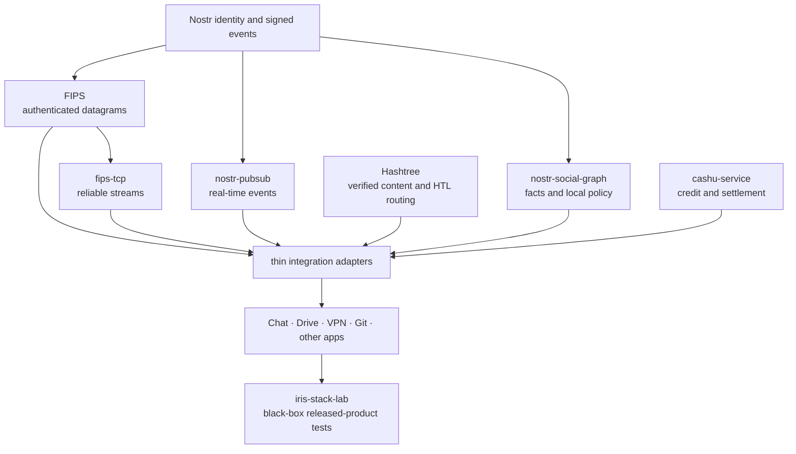

# Iris Stack status and test ownership

This is an engineering assessment as of 2026-07-16. It complements the
[architecture overview](iris-stack.md): the overview explains the intended
system, while this page distinguishes implemented foundations from integration
work and assigns tests to the repository that owns each failure.

## Overall assessment

The stack has the essential building blocks for permissionless identity,
authenticated connectivity, reliable streams, decentralized real-time events,
verified storage and content routing, viewer-local social policy, and
permissionless settlement. Decentralized compute is not required to make those
capabilities useful. If it becomes useful, it can be introduced later as a
metered service route rather than inserted into every layer.

The principal risk is now integration complexity, not a missing universal
protocol. The architecture stays tractable when it enforces four rules:

1. One repository owns each wire contract and its resource bounds.
2. Capability cores do not depend on product repositories or the stack lab.
3. Products remain standalone and retain their application-owned outbound
   links when same-host peers appear or disappear.
4. A shared abstraction should delete more policy and failure modes than it
   adds; similar-looking code is not enough reason to merge semantics.

The economic loop is less mature than the protocol loop. Cashu service credit,
receipts, and settlement adapters exist, but paid forwarding and paid storage
still need released-product simulations with a real local mint, failures,
replay, restart, and settlement recovery before they should be described as a
deployed market.

## Dependency direction

Optional adapters may join capabilities; they must not invert the arrows. In
particular, `nostr-pubsub` announces events and content references but is not a
blob-routing layer. FIPS transports authenticated traffic but does not own
Hashtree HTL or settlement policy.

## Component status

| Area | Evidence as of 2026-07-16 | Remaining integration risk |
| --- | --- | --- |
| FIPS | Rust 0.4.1 and the matching TypeScript runtime tuple provide authenticated links, fixed loopback UDP rendezvous, capability exchange, routing, and multiple carriers. The same-host identity hint is proved by the ordinary authenticated handshake. Seven repeated Chromium-to-Rust process gates and the unchanged 14-case browser interop suite passed, including forced browser death and reconnection from a replacement page. | Continue cross-carrier churn, bounded-admission, and mobile lifecycle gates. A local peer must never become a mandatory daemon or implicit egress owner. |
| `fips-tcp` | Rust crates 0.2.0 provide reliable ordered streams over FIPS and cross-language wire fixtures. | Reset, retransmission, acknowledgment, backpressure, and long loss/reordering simulations belong here. Application record delivery is a separate semantic layer. |
| `nostr-pubsub` | Core 0.1.11 and FIPS adapter 0.3.1 share the standard `REQ`/`EVENT`/`CLOSE` service and have simulator, stress, role-blind discovery, and Cashu-incentive gates. | Browser and native consumers must use the shared carrier instead of product-private endpoint namespaces. Offline history remains a storage concern. |
| Hashtree | Core 0.2.84, FIPS transport 0.4.0, and CLI 0.2.85 use one `BlobRoute` request/reply model. The duplicate raw-datagram FIPS mesh carrier is removed. `hashtree-network` remains the canonical HTL router. | Complete native/TypeScript route parity, then exercise multi-hop HTL, churn, corrupt providers, caching, and paid routes through released artifacts. |
| Social graph and facts | Signed facts, graph traversal, social policy, UUID identity tools, exact fact lookup, and the `nostr-identity` 0.4.0 crate exist. | Unify fact-name search and recovery UX; gate FIPS identity bindings and resource-policy inputs without creating a global reputation score. |
| Cashu service layer | Published `cashu-service` 0.3.1 owns bounded peer credit, useful-service receipts, Cashu transfer, and settlement adapters. Its reusable simulation feature starts a real loopback CDK mint with SQLite and covers proof transfer and double-spend rejection. | Compose that foundation into crash-safe, replay-safe paid bandwidth and storage product flows with outage and restart recovery. Mint trust and cross-mint settlement remain explicit policy. |
| Iris Chat | Native 0.1.36 uses the FIPS 0.4 stack, shared decentralized pub/sub, and paged device synchronization. | Keep native and browser device-sync fixtures byte-compatible, and test connection loss after local stream acceptance so resynchronization—not wishful delivery—is the recovery mechanism. |
| Nostr VPN | Its shared FIPS/pub-sub integration preserves explicit application-owned UDP roster links and standalone operation. | Test roster churn concurrently with other local products. Do not delegate VPN routes or roster policy to a same-host process. |
| Iris Drive | The canonical storage interface and same-host provider path use Hashtree blob routes, while the product retains standalone storage and outbound links. | Finish the native carrier release gate and repeatedly prove large multi-frame retrieval, provider death/replacement, and fallback through the product-owned route. |
| Iris Git | Git data and mutable repository roots already use Hashtree and Nostr. | Treat deeper FIPS discovery and paid repository storage as product integrations, not reasons to fork Hashtree transport or Git object semantics. |

Versions identify the verified native release boundary on the stated date; the
repository sources and package registries remain the authority for later
versions.

### Reproducible native release evidence

- FIPS Rust `v0.4.1` is commit
  `5af4f0d02108dcca7b967934230aa6a69abc95fa`. The published `fips-core`
  0.4.1 crate checksum is
  `e720d19a0f9b007dad9c03e7e952df8cb79bd0e1a7ab4da1c5cb8c2619cadbe0`;
  the published `fips-endpoint` 0.4.1 checksum is
  `7ab3110794075a83a020c61978ea29d990fd68320a43b1b9e388b04abbf202fe`.
  The seven browser-process passes used the real Rust process and Chromium,
  sent authenticated FIPS traffic, killed the first browser page, and proved a
  replacement page could reconnect.
- The matching TypeScript release is commit
  `268938c8fe0d35fe4f8fcb3882399291be448897`, tagged `runtime-v0.0.24`:
  core 0.0.24, browser 0.0.6, WebRTC 0.0.40, Ethernet 0.0.23, and memory
  0.0.4. All TypeScript unit tests and the unchanged 14-case Playwright suite
  passed against native commit `5af4f0d02108dcca7b967934230aa6a69abc95fa`;
  a clean remote-tarball import also passed.
- `nostr-identity` 0.4.0 was released from the social-graph repository at
  commit `d8faabd1bf865f4cf95c9d56eddf99de31436862`; its published crate
  checksum is
  `95fd048871579a175d1c38d1ea947f1034206d93696ea7ac74d140979e8022bb`.
- `cashu-service` source commit
  `b45a7e16744928b2ebae54e42e8f62c1d7eabdcb` is available from both its
  Hashtree and GitHub remotes. The published `cashu-service` 0.3.1 checksum is
  `c339af6a3c7a748230e980df1e89c4199532b33222d3c47e0cf148ab4d15498f`;
  the published `cashu-credit` 0.3.0 checksum is
  `c35743015747540d9c912284f10ccf89c40ded00c51fd3710c08c60700c71339`.
  This proves the reusable real-mint foundation, not the still-pending paid
  Iris product failure/replay/resumption gate.

## Repository organization

Keep the capability repositories separate. Their state machines, release
cadence, fuzz targets, language implementations, and downstream consumers are
different enough that a monorepo would hide rather than remove coupling.

| Repository | Owns | Must not own |
| --- | --- | --- |
| `fips` / `fips-ts` | Public-key-addressed links, Noise authentication, carriers, routing, discovery, admission, authenticated capability roster | Reliable application streams, blob HTL, event subscription policy, product egress policy |
| `fips-tcp` | Reliable ordered byte streams and their Rust/TypeScript wire contract | Product record schemas or application commit semantics |
| `nostr-pubsub` | Nostr subscription/event protocol, source policy, deduplication, carrier adapters | Blob transfer, durable mailbox/history, product-specific event formats |
| `hashtree` | Blob/tree formats, verification, cache policy, `BlobRoute`, HTL forwarding, content indexes, Git/release data, paid route wrappers | FIPS link routing, Nostr event distribution, product UI |
| `nostr-social-graph` | Signed fact interpretation, graph traversal, contextual names, reputation and policy inputs | A global name registry or global trust score |
| `cashu-service` | Credit, receipts, transfer and settlement primitives | Product pricing, access policy, or claims of globally trusted mints |
| Product repositories | Startup, authorization, durable product effects, user policy, explicit peers and outbound links | Copies of capability carriers, discovery protocols, or retry state machines |
| `iris-stack` | Durable public architecture, machine-readable ownership map, and black-box process/released-artifact lab | Another implementation of FIPS, TCP/FIPS, pub/sub, Hashtree, or product logic |

`iris-stack-lab` therefore belongs in this repository. It is a consumer-only
integration lab and must never become a dependency of a capability or product.

## Test ownership

Tests should be placed where the failed invariant can be fixed without editing
an unrelated layer.

| Repository | Required gates |
| --- | --- |
| `fips` | Noise identity proof; capability authenticity; route and carrier churn; fixed-loopback bind/rebind; admission/resource bounds; every app retaining independent direct links |
| `fips-tcp` | Loss, duplication, reordering, reset, marker acknowledgment, flow control, concurrent streams, bounded buffers, and Rust/TypeScript vectors/process interop |
| `nostr-pubsub` | Codec vectors; inventory/want convergence; deduplication; role-blind discovery; malicious peers; simulator scale; real FIPS and Cashu adapters |
| `hashtree` | Local hit/miss; exact HTL decrement; multi-hop and cycles; bounded fan-out; route-local `NoResult`; timeout/error distinction; corrupt reply rejection; cache population; provider replacement; paid route behavior |
| `nostr-social-graph` | Deterministic graph and fact interpretation; key/device binding; local-policy boundaries; malicious or conflicting claims |
| `cashu-service` | Credit limits; idempotent receipts; double-spend/replay rejection; partial settlement; mint outage; restart recovery; real local-mint processes |
| Product repositories | Standalone startup; explicit outbound links; authorization; durable effects; app protocol recovery; graceful and forced dependency death |
| `iris-stack` | Released-artifact compatibility; several real product processes on one host; same-host discovery; provider churn; direct egress preservation; paid route and crash matrices |

Simulators should run production state machines, not simplified copies.
Deterministic protocol simulations stay with their owner; cross-repository
black-box simulations stay here. Release gates should prefer registry artifacts
and consumer lockfiles. Path dependencies are useful during development but
cannot prove that published packages compose.

## Redundancy and complexity audit

The desired direction is one implementation per semantic responsibility:

- One fixed-loopback FIPS UDP rendezvous mechanism. No parallel filesystem,
  TCP, Ethernet-only, daemon-election, or shared-egress protocol.
- One authenticated FSP capability roster. The plaintext loopback exchange is
  only an identity hint and carries no capabilities or policy.
- One Hashtree blob request/reply contract for local stores, same-host
  providers, remote mesh routes, cloud adapters, and paid wrappers. `NoResult`
  means only that one bounded route produced no data.
- One Hashtree HTL router. FIPS hops and terminal adapters do not consume HTL.
- One standard Nostr pub/sub service. Large bytes travel through Hashtree, not
  through a second pub/sub blob protocol.
- Product-owned control and synchronization schemas remain product-owned until
  an extraction removes meaningful code and preserves their different retry,
  authorization, resync, and commit semantics.

The native Hashtree migration removed thousands of lines of duplicate carrier
code. Similar cleanup in products is valuable when it deletes a private
transport, but a tiny common frame codec alone is not automatically a
simplification: if the shared package plus language parity adds more code than
the consumers remove, wait for stronger semantic convergence or a third user.

## Priority test backlog

1. Run a released-artifact lab with Iris Chat, Iris Drive, and Nostr VPN at the
   same time. Kill and replace local providers while every product retains its
   own explicit outbound connectivity.
2. Run paid FIPS forwarding and paid Hashtree storage against a real local
   Cashu mint. Inject rejection, timeout, duplicate receipt, crash, restart,
   and eventual settlement.
3. Enforce the same native/TypeScript fixtures in owner-repository release
   gates, including browser constraints where native loopback UDP is not
   available.
4. Add long-running loss, churn, bounded-memory, file-descriptor, and process
   death tests using production state machines.
5. Gate exact authenticated capability and service-port selection so an
   arbitrary connected peer can never be mistaken for a provider.
6. Treat record acceptance, TCP acknowledgment, and application commit as
   distinct states in product protocols; make reset/resync behavior explicit.
7. Add Iris Git only after the shared content and event paths are sufficient;
   do not create Git-specific copies of discovery or blob routing.

This backlog deliberately does not include a generic decentralized compute
substrate. It can be evaluated later against a concrete workload, proof model,
resource market, and failure contract.
